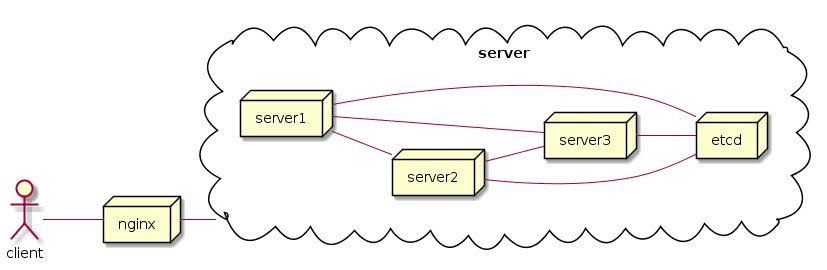
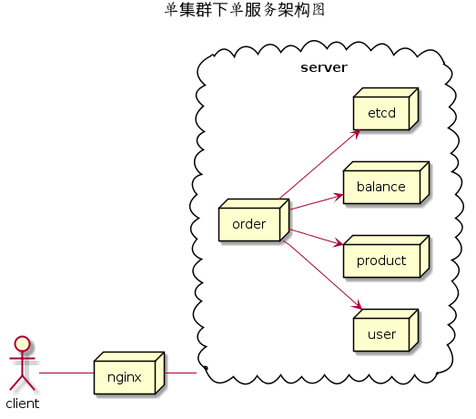

# micro_framework feature
1. 支持插件化的方式集成服务，减少业务代码与框架的耦合
2. 支持优雅关闭，热重启 
3. 支持日志打印sql语句, 集成gorm
4. 支持etcd服务发现,并由etcd对调用的服务进行负载均衡
5. 支持服务限流，并在日志定时打印qps信息
6. 支持结构化日志, 日志包含行号，filename，pid等信息
7. 支持二进制以及容器化部署，支持k8s 容器编排,同时支持单集群，多集群部署方式 
8. 支持opentracing分布式分布式追踪, 同一个traceid串联一个请求调用的所有服务

# micro_framework架构

## 1. 单集群mic_framework架构图

1. 每个server提供所有的微服务，各个server互为备份，同时对外暴露自身的所有服务
2. server之间的互相访问，配置文件只需要提供需要访问的服务名称，具体访问到哪一个server由有etcd负载均衡算法决定
3. 每个具体的服务(server1,server2,server3)对应的是pod，同属于一个server对象，对外暴露通过nginx，nginx对应的是ingress-nginx-controller，支持反向代理grpc协议

## 2. 多集群micro_framework架构图

1. 每个集群只提供单独一种微服务，即server1.1,server1.2, server1.3提供相同服务,互为备份
2. 不同集群提供不同的微服务，跨服务即是跨集群，server之间的互相访问时，程序需要配置待访问服务的域名, 具体访问到哪一个pod由对应集群ingress调度以及集群内etcd负载均衡调度决定
3. 每个具体的服务(server1,server2,server3)对应的是pod，同属于一个server对象，对外暴露通过nginx，nginx对应的是ingress-nginx-controller，支持反向代理grpc协议

## 3. 单机群时部署订单下单服务demo

1. 该demo分为4个微服务:order提供订单服务，user提供用户校验服务，product提供商品校验查询服务，balance提供余额变动服务

# 微服务思考
## 服务拆分
1. 服务拆分尽可能细致，服务内部逻辑尽可能简单；对于有数据存储有状态的微服务，不能共享数据库表，数据共享以微服务接口形式提供;服务内部的实现只依赖接口定义，不依赖其他服务内部逻辑；另外，具有强一致性要求的一组业务概念，属于同一个聚合，不建议拆到不同服务中,尽量避免分布式事务

## 服务发现
1. 服务调用方与服务提供方解耦，提供方在etcd注册服务，调用方使用服务，服务的负载均衡由etcd实现

## 服务治理
1. 需要提供日志串联功能，需要有服务发现功能，需要有集群状态,server性能实时监控告警功能，同时也有故障现场保存功能
2. 需要实现服务熔断，降级，限流，由于istio的性能开销问题，暂不考虑，准备由由程序实现
