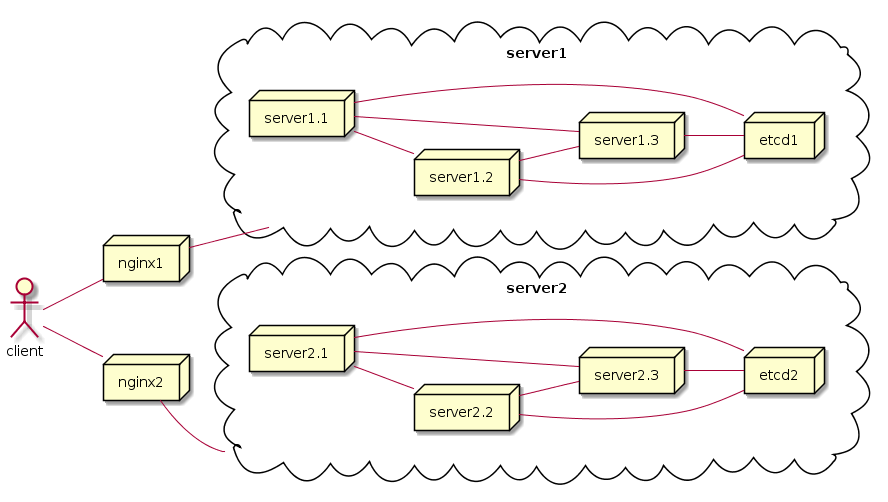

# micro_framework feature
1. 使用etcd服务发现，etcd采用短连接
2. 服务的创建采用注册方式，减少业务代码与框架的耦合
3. 优雅关闭，热重启 
4. 使用logrus，结构化日志; 统一requestid，分布式追踪; 日志支持filename，行号
2. 支持容器化部署，支持k8s 容器编排,支持单集群，多集群可升缩部署 

# micro_framework架构

## 1 单集群mic_framework架构图

1. 每个server提供所有的微服务，各个server互为备份，同时对外暴露自身的所有服务
2. server之间的互相访问，配置文件只需要提供需要访问的服务名称，具体访问到哪一个server由有etcd负载均衡算法决定

## 2 多集群micro_framework架构图

1. 每个集群只提供单独一种微服务，即server1.1,server1.2, server1.3提供相同服务,互为备份
2. 不同集群提供不同的微服务，跨服务即是跨集群，server之间的互相访问时，程序配置文件需要表名配置访问服务的域名, 具体访问到哪一个pod由对应集群ingress调度以及集群内etcd负载均衡调度决定
